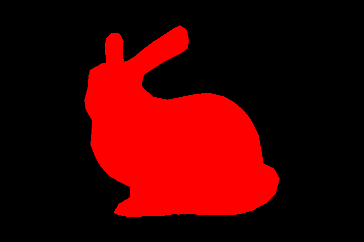

Rasterization Basics
===============

Implemented a rendering system for triangulated 3D models based on rasterization. 

1: Load and Render a 3D model 
------------------

1. Build the camera tranformation matrix
2. Build the Orthographic Projection matrix, see Assignment 3 for computing t and l.
3. Fill the shaders to rasterize the bunny in red

Output:

2: 
----------------

Render the bunny using a wireframe; only the edges of the triangles are drawn.

Output:

3: Shading 
-------------

In **Flat Shading** each triangle is rendered using a unique normal (i.e. the normal of all the fragments that compose a triangle is simply the normal of the plane that contains it).

In **Per-Vertex Shading** the normals are specified on the vertices of the mesh, the color is computed for each vertex, and then interpolated in the interior of the triangle.

1. Implement the light equation
2. Implement the depth check
3. Compute the per face normals and render the bunny with flat shading
4. Compute the per vertex normals and render the bunny with vertex shading

Output for flat shading:

Output for vertex shading:

3.1: Object Transformation
----------------------------------

Produced 3 gif videos, one for each rendering type used above (i.e., wireframe, flat, and vertex).

Output animation for flat shading:

4: Camera 
-------------------------------

Implemented a *perspective camera*. 

Output for flat shading and perspective camera:

Output for vertex shading and perspective camera:

